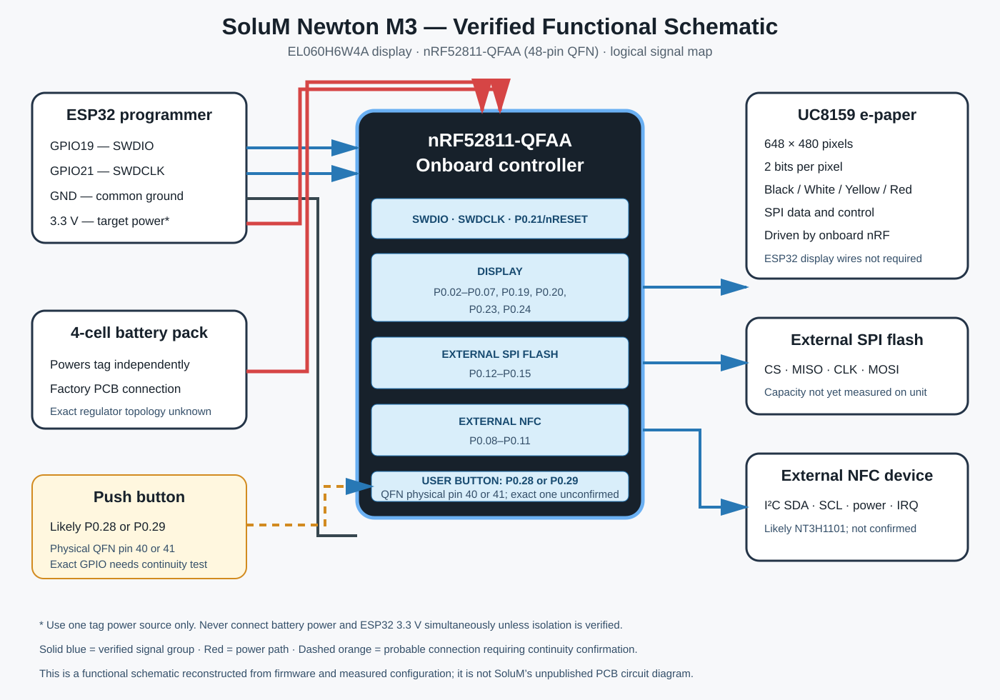

# RoggenCore / NewtonFrame

RoggenCore turns a SoluM/Newton M3 electronic shelf label into a standalone 648×480 four-color BLE photo frame. The repository also contains RoggenCore Manager for safe Windows-based discovery, backup, unlocking, firmware installation, verification, and recovery through an ESP32 SWD bridge.

Manager can provision bridge Wi-Fi securely over the local USB cable, catalogs timestamped CRC/SHA-verified backups, and supports full-readback-verified rollback while preserving UICR.

## Project status

| Component | Status |
|---|---|
| ESP32 SWD connection, unlock, and recovery | Tested on hardware |
| Standalone nRF52811 Photo Viewer | Tested on hardware |
| Browser conversion and ESP32 image upload | Tested end to end |
| RoggenCore nRF52811 S112 BLE receiver | Hardware verified, including transfer, refresh, sleep, wake, and RGB indicators |
| RoggenCore Studio Web Bluetooth upload | Hardware verified at approximately 2.5 KiB/s |
| RoggenCore Manager for Windows | Implemented with discovery, backups, CRC/SHA verification, upgrade, recovery, and diagnostics |

Keep a verified flash/UICR backup and the ESP32 SWD recovery connection available during firmware upgrades.

## Supported hardware

- SoluM/Newton M3 tag with an nRF52811
- `EL060H6W4A` 648×480 black/white/yellow/red e-paper panel
- ESP32 development board for installation, recovery, and the tested uploader
- 3.3 V logic and power only

Panel data is packed at 2 bits per pixel, four pixels per byte, most-significant pair first: black `00`, white `01`, yellow `10`, and red `11`.

## Repository layout

- [`data/index.htm`](data/index.htm) — mobile image converter, dithering, ESP32 upload, and Web Bluetooth uploader
- [`site/`](site/) — standalone installable RoggenCore Studio for conversion and direct BLE upload
- [`tools/RoggenCore.Manager/`](tools/RoggenCore.Manager/) — native Windows device manager
- [`firmware/RoggenCore/`](firmware/RoggenCore/) — integrity-manifested upgrade and recovery packages
- [`tests/`](tests/) — automated firmware-package, CRC, packing, and manager-core tests
- [`src/`](src/) — ESP32 SWD programmer and HTTP service
- [`Tag_Photo_Viewer/`](Tag_Photo_Viewer/) — tested standalone nRF52811 panel firmware
- [`Tag_BLE_Photo_Viewer/`](Tag_BLE_Photo_Viewer/) — experimental S112 BLE receiver and panel driver
- [`PHOTO_FRAME_MANUAL.md`](PHOTO_FRAME_MANUAL.md) — wiring, installation, use, recovery, and troubleshooting
- [`docs/BLE_PHOTO_PROTOCOL.md`](docs/BLE_PHOTO_PROTOCOL.md) — GATT protocol and direct-to-panel streaming design
- [`SoluM_ESP32_connections.md`](SoluM_ESP32_connections.md) — concise SWD wiring reference
- `solum_*_test/` — direct-panel diagnostic sketches

## Tested ESP32 workflow

1. Clone this repository recursively, or initialize its `Tag_FW_nRF52811` submodule after cloning.
2. Read the [Photo Frame Manual](PHOTO_FRAME_MANUAL.md), especially its 3.3 V and backup warnings.
3. Copy `include/wifi_credentials.example.h` to `include/wifi_credentials.h` and set local credentials. The copied file is ignored by Git. Leaving `WIFI_SSID` empty enables AP-only operation.
4. Build the root project with PlatformIO and upload both firmware and the `data/` filesystem to the ESP32.
5. Build and install [`Tag_Photo_Viewer`](Tag_Photo_Viewer/) on the nRF52811 through SWD.
6. Open `http://swd.local/`, convert a photo, inspect the preview, and flash it to the tag.

If station Wi-Fi is unavailable, the ESP32 starts the documented `SWD-Photo` fallback access point.

## RoggenCore BLE workflow

RoggenCore uses Nordic nRF5 SDK 17.1.0 and S112 7.2.0. It advertises as `RoggenCore`, receives an offset-addressed 77,760-byte frame, validates CRC-32, and refreshes only after a valid COMMIT. Image bytes stream directly into UC8159 display RAM, avoiding a framebuffer in the nRF52811's limited RAM and flash.

Use [RoggenCore Studio](https://wicked-north.github.io/NewtonFrame/) to crop, rotate, mirror, quantize, dither, download, and send images. On iPhone, Web Bluetooth requires a compatible browser such as Bluefy; Safari does not expose Web Bluetooth.

For upgrades, use the latest `firmware/RoggenCore/<version>/upgrade-manifest.json`. For factory unlock/conversion, use the matching recovery manifest only through RoggenCore Manager after reviewing its warnings. The manager records timestamped full-flash/UICR backups and will not boot a mismatched readback.

## Safety

- Never connect the tag to 5 V.
- Preserve UICR and a known-good full-flash backup before erasing or replacing firmware.
- Do not power the tag from multiple sources.
- Do not run direct-display tests while the nRF52811 is also driving the panel.
- Never publish `include/wifi_credentials.h` or other local secrets.

## Credits and license

The ESP32 SWD programmer is derived from [atc1441/ESP32_nRF52_SWD](https://github.com/atc1441/ESP32_nRF52_SWD). nRF52811 board research also used [OpenEPaperLink/Tag_FW_nRF52811](https://github.com/OpenEPaperLink/Tag_FW_nRF52811). Original copyright and SPDX notices are retained in source files.

NewtonFrame is distributed under the GNU General Public License v3.0; see [`LICENSE`](LICENSE).
